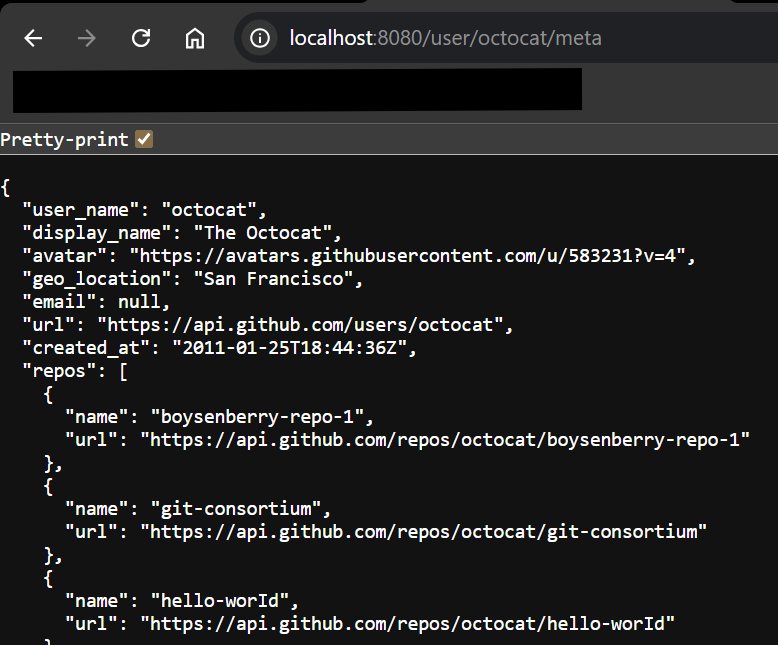

# BranchExercise
The app is a simple Spring Boot webserver hosted on a tomcat via gradle. It's main feature is to
expose and API that accepts a userName and returns some basic metadata about that user.

### Usage
On a system with java installed and configured, clone the repo and then simply run the command 
"gradlew bootRun" from the root directory of the project. ctrl+c can be used to stop execution.

To use the api exposed go to the url below. Substitute 'myuser' in the path with the desired 
user name.

http://localhost:8080/user/myuser/meta

The response will be JSON formatted metadata about the use as collected from GitHub

### Structure
Packages are organized by feature as described below. Using feature organization makes it easy
to find code related to a specific feature.
 - client: code for dealing with other web services
   - having an interface makes it easy to change the data source if needed
   - response validation and error handling are isolated to the implementation of the interface
 - user: folder for all the user related logic
   - Controller class: defines/configures API's expose by the web server and input validation
   - Service class: business logic/orchestrator to execute the task
   - models: data classes for the request/response
- util: common utils that are/could be needed by multiple packages

### Packages
  - spring-boot-starter-cache provides all the code necessary to implement basic caching via @Cacheable
  - spring-boot-starter-restclient provides a robust prebuilt REST api client, much easier to 
use than building my own
  - spring-boot-starter-web core framework for the web server
  - spring-boot-starter-validation allows validation through annotations instead of having to
build custom classes
  - jackson-databind used to provide robust JSON serialization